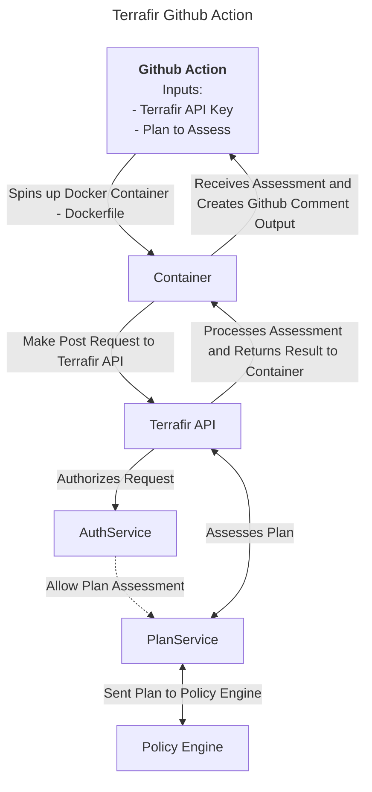

# Terrafir Github Action
## 👋 Overview 
This Github Action is used to assess Terraform plans using [Terrafir](https://www.terrafir.com). It is intended to be used in a CI/CD pipeline to assess Terraform plans before they are applied. You can see the output of the plan in the Terrafir dashboard or the Github Action output.

## 🚀 Usage
### Inputs
| Name | Description | Required |
| --- | --- | --- |
| apiKey | The API key used to authenticate with Terrafir | true |
| email | The email address of the user who owns the API key | true |
| inputFilePath | The location on the Github Runner to the Terraform plan to assess | true |
| __WIP: verbose__ | ~~Whether or not to print the assessment to the Github Action output~~ | false |

### Flow

