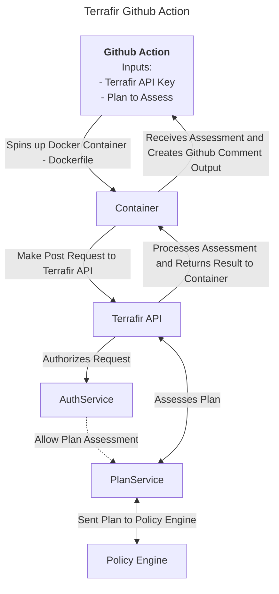

# terrafir-github-action

### Flow

```mermaid
---
title: Terrafir Github Action
---
flowchart TD
    A["`__Github Action__
        Inputs:
        - Terrafir API Key
        - Plan to Assess
    `"]--Spins up Docker Container - Dockerfile-->B[Container]
    B --Make Post Request to Terrafir API-->C[Terrafir API]
    C --Authorizes Request-->D[AuthService]
    D -.Allow Plan Assessment.->E
    C <--Assesses Plan -->E[PlanService]
    E <--Sent Plan to Policy Engine -->F[Policy Engine]
    C --Processes Assessment and Returns Result to Container-->B
    B --Receives Assessment and Creates Github Comment Output-->A
```
