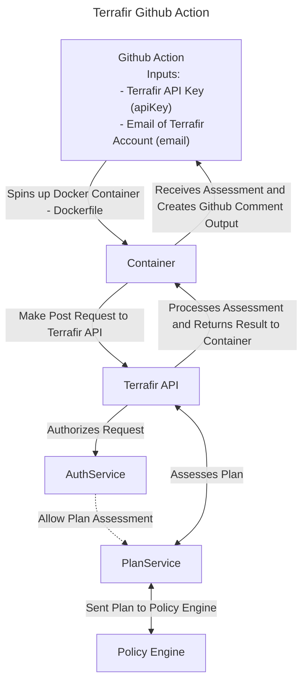

# Terrafir Github Action

## 👋 Overview

This Github Action is used to assess Terraform plans using [Terrafir](https://www.terrafir.com). It is intended to be used in a CI/CD pipeline to assess Terraform plans before they are applied. You can see the output of the plan in the Terrafir dashboard or the Github Action output.

## 🚀 Usage

### Inputs

| Name             | Description                                                        | Required |
| ---------------- | ------------------------------------------------------------------ | -------- |
| apiKey           | The API key used to authenticate with Terrafir                     | true     |
| email            | The email address of the user who owns the API key                 | true     |
| **WIP: verbose** | Whether or not to print the assessment to the Github Action output | false    |

### Flow



### Sample CI/CD Pipeline Using Terrafir Github Action

```yaml
name: Terrafir Test Action

on:
  push:
    branches:
      - master
  workflow_dispatch:
    inputs:
      target:
        description: "Test github action"
        required: false
        default: "run_terrafir_github_action"
        type: choice
        options:
          - run_terrafir_github_action
      cloud_provider:
        description: "Cloud provider to use"
        required: true
        default: "aws"
        type: choice
        options:
          - aws
          - gcp
          - azure

env:
  CLOUD_PROVIDER: aws
  REGION: us-east-2

jobs:
  run_terrafir_github_action:
    if: ${{ github.event.trigger != 'workflow_dispatch' || inputs.target == 'all' || inputs.target == 'run_terrafir_github_action' }}
    runs-on: ubuntu-latest
    name: Run Terrafir GitHub Action
    defaults:
      run:
        working-directory: .
    steps:
      - name: Checkout Code
        uses: actions/checkout@v2

      - name: Setup Terraform
        uses: hashicorp/setup-terraform@v1
        with:
          terraform_version: 1.5.7

      - name: Configure AWS Credentials
        uses: aws-actions/configure-aws-credentials@v1
        if: env.CLOUD_PROVIDER == 'aws'
        with:
          aws-access-key-id: ${{ secrets.ACCESS_KEY_ID }}
          aws-secret-access-key: ${{ secrets.ACCESS_KEY }}
          aws-region: ${{ env.REGION }}

      - name: Configure GCP Credentials
        uses: google-github-actions/setup-gcloud@v1.1.1
        if: env.CLOUD_PROVIDER == 'gcp'
        with:
          project_id: ${{ secrets.GCP_PROJECT_ID }}
          service_account_key: ${{ secrets.GCP_SA_KEY }}
          export_default_credentials: true

      - name: Configure Azure Credentials
        uses: azure/login@v1
        if: env.CLOUD_PROVIDER == 'azure'
        with:
          creds: ${{ secrets.AZURE_CREDENTIALS }}

      - name: Save plan to Runner workspace
        id: plan
        run: |
          terraform plan --out tfplan.binary
          terraform show -json tfplan.binary > input.json # Currently needs to output to input.json

      - name: Run Terrafir
        uses: sachasmart/terrafir-github-action@v1
        with:
          email: ${{ secrets.TERRAFIR_EMAIL }}
          apiKey: ${{ secrets.TERRAFIR_API_KEY }}
```
